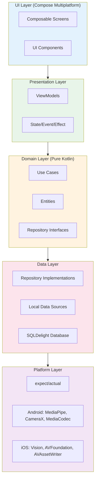
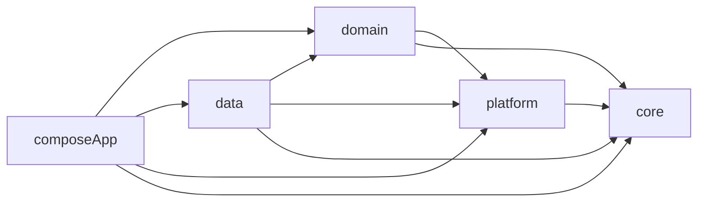
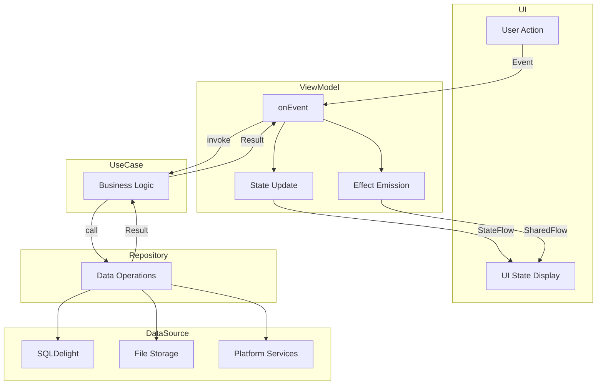
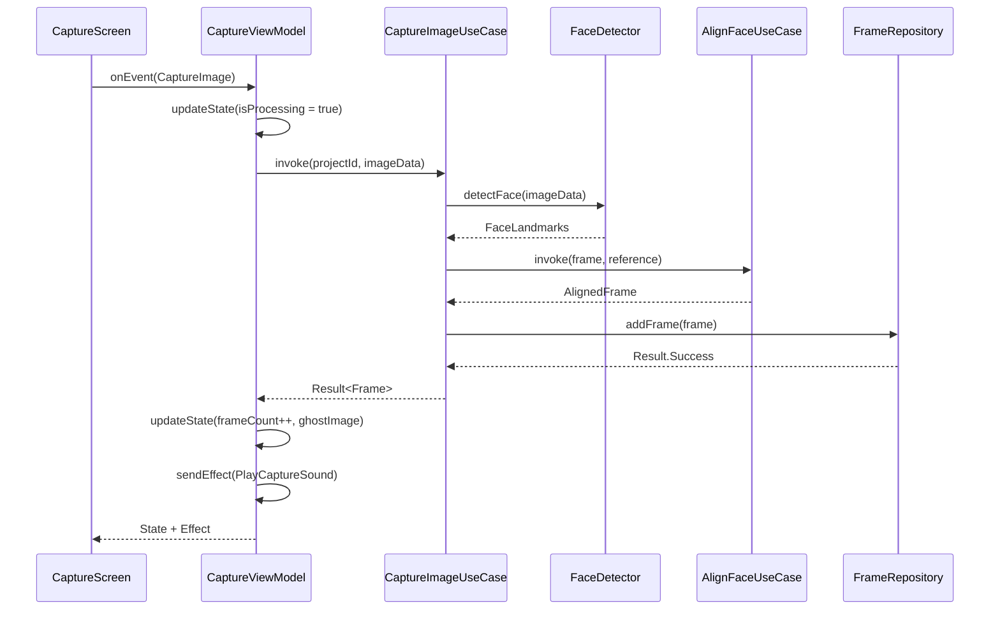
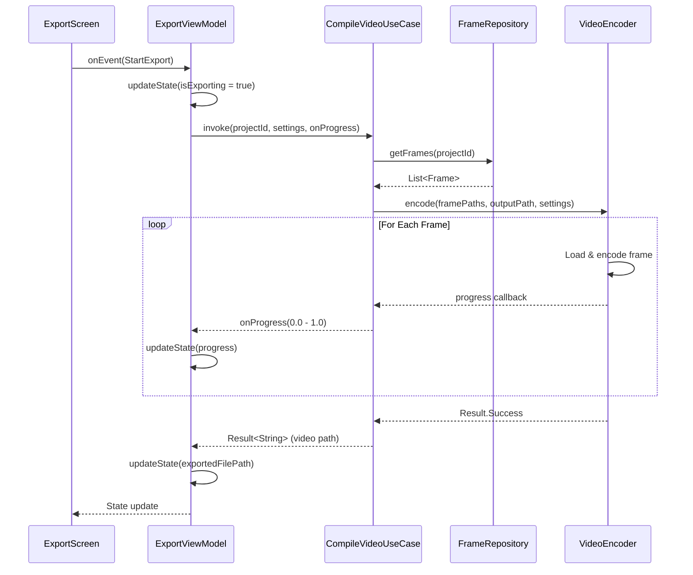

# FrameLapse Architecture

This document provides detailed technical architecture documentation for FrameLapse.

> For algorithm details, see [docs/ALGORITHMS.md](./docs/ALGORITHMS.md)
> For API reference, see [docs/API_REFERENCE.md](./docs/API_REFERENCE.md)

---

### 1. High-Level Architecture: Clean Architecture + KMP

The application follows a **Clean Architecture** approach with **Unidirectional Data Flow (UDF)**. The core philosophy is to share as much logic as possible (business rules, view models, data storage) while keeping heavy media processing (camera, ML, video encoding) native for maximum performance.

#### Architecture Diagram

#### Module Dependencies

#### The Layers

1.  **UI Layer (Compose Multiplatform):**

    -   **Technology:** Jetpack Compose (Android) + Compose Multiplatform (iOS).
    -   **Responsibility:** Renders the interface, handles user input, and observes UI state.
    -   **Approach:** A single set of Kotlin UI code renders native widgets on Android and Metal-accelerated graphics on iOS. Platform-specific UI (like a Camera View) is embedded using interoperability composables (`AndroidView` / `UIKitView`).

2.  **Presentation Layer (Shared ViewModels):**

    -   **Technology:** Kotlin Coroutines, StateFlow, AndroidX Lifecycle (KMP compatible).
    -   **Responsibility:** Holds the application state (e.g., "CameraReady", "Processing", "Exporting"). It bridges the UI and the Domain layer.
    -   **Approach:** ViewModels survive configuration changes and expose immutable state streams to the UI.

3.  **Domain Layer (Shared Logic):**

    -   **Technology:** Pure Kotlin.
    -   **Responsibility:** Contains the core business rules.
    -   **Components:**
        -   **Entities:** Data models (e.g., `Project`, `TimelapseFrame`, `AlignmentSettings`).
        -   **Use Cases:** Specific actions (e.g., `CaptureImageUseCase`, `AlignFaceUseCase`, `CompileVideoUseCase`). This layer knows _what_ to do, but not _how_ the platform does it.

4.  **Data Layer (Shared Repositories):**

    -   **Technology:** SQLDelight (Database), Ktor (Networking - if cloud sync is added), Okio (File I/O).
    -   **Responsibility:** Manages data sources. It decides whether to fetch data from the local database or the file system.

5.  **Platform Layer (Native Implementation):**
    -   **Technology:** `expect`/`actual` interfaces.
    -   **Responsibility:** Implements the hardware-intensive features defined by the Domain layer using native APIs (CameraX, Vision, AVFoundation).

---

### 2. Technology Stack & Libraries

| Capability       | Shared (KMP) Technology       | Android Implementation     | iOS Implementation                |
| :--------------- | :---------------------------- | :------------------------- | :-------------------------------- |
| **Language**     | Kotlin 2.x                    | Kotlin (JVM)               | Kotlin -> Swift Interop           |
| **UI Framework** | Compose Multiplatform         | Jetpack Compose            | Compose (Skia) + UIKit            |
| **Navigation**   | Voyager or Jetpack Navigation | Native Activity/Fragment   | SwiftUI/UIKit Hosting             |
| **DI**           | Koin                          | Koin Android               | Koin Native                       |
| **Database**     | SQLDelight                    | SQLite (Android Driver)    | SQLite (Native Driver)            |
| **Async**        | Coroutines & Flow             | Dispatchers.Main/IO        | Dispatchers.Main/Default          |
| **Camera**       | _Abstract Interface_          | **CameraX** (Jetpack)      | **AVFoundation**                  |
| **ML / Vision**  | _Abstract Interface_          | **MediaPipe** / **ML Kit** | **Vision Framework** / **CoreML** |
| **Video Encode** | _Abstract Interface_          | **MediaCodec** (Hardware)  | **AVAssetWriter** (Hardware)      |
| **File System**  | Okio                          | `java.io.File`             | `FileManager` (Foundation)        |

---

### 3. Detailed Technical Approaches

#### A. Camera & Capture Strategy

Instead of a generic cross-platform camera library (which often lacks advanced control), the architecture uses the **Platform View** pattern.

-   **Approach:** Define a Composable `CameraPreview` in common code.
    -   **Android:** Wraps a `PreviewView` connected to CameraX. It handles lifecycle binding automatically.
    -   **iOS:** Wraps a `UIView` layer backed by an `AVCaptureSession`.
-   **Overlay System:** The "Ghost" image (previous day's photo) is rendered via a standard Compose `Image` component with alpha transparency, placed directly on top of the native camera stream within a `Box` layout. This ensures the overlay is rendered identically on both platforms without complex native code.

#### B. Face Detection & Alignment Pipeline

This is the most critical logic for stabilization.

1.  **Face Detection:** The app requests an `ImageProcessor` interface.
    -   **Android:** Uses **Google MediaPipe** or **ML Kit Face Detection**. These provide 468 3D face landmarks.
    -   **iOS:** Uses Apple's native **Vision Framework** (`VNDetectFaceLandmarksRequest`). This is battery-efficient and pre-installed on iOS.
2.  **Normalization (The Algorithm):**
    -   The Domain layer calculates the centroid of key landmarks (Left Eye, Right Eye, Nose Tip).
    -   It computes an **Affine Transformation Matrix** (Translation, Rotation, Scale) required to move the current face's eyes to match a fixed coordinate system (e.g., eyes always at 40% height, 200px apart).
3.  **Cropping:** The image is mathematically warped and cropped. This processing happens asynchronously on background threads (Coroutines) to keep the UI smooth.

#### C. Video Compilation (Timelapse Generation)

To avoid large library sizes (like bundling FFmpeg), the app uses **Hardware Acceleration**.

-   **Approach:** An `Encoder` interface takes a list of image paths and an output config (FPS, Resolution).
-   **Android:** Uses `MediaCodec` and `MediaMuxer`. It feeds bitmaps into a Surface input, which the hardware encoder converts to H.264/HEVC frames.
-   **iOS:** Uses `AVAssetWriter` and `AVAssetWriterInputPixelBufferAdaptor`.
-   **Benefit:** This approach keeps the app size small (<30MB) and rendering extremely fast compared to software encoders.

#### D. Data Persistence & Storage

-   **Metadata:** A relational database (SQLDelight) stores the "Projects" (timelines) and "Frames" (individual photos). It tracks the original file path, the aligned file path, timestamps, and detection confidence scores.
-   **File Storage:** Images are stored in the App's private sandbox documents directory. They are never added to the public gallery unless the user explicitly exports them, keeping the user's camera roll clean.

### 4. Workflows & State Management

#### Data Flow Diagram

**The Capture Loop:**

**The Compilation Loop:**

---

### 5. Related Documentation

- [Algorithms](./docs/ALGORITHMS.md) - Detailed algorithm implementations with diagrams
- [Navigation Map](./docs/NAVIGATION_MAP.md) - Screen flow and navigation patterns
- [API Reference](./docs/API_REFERENCE.md) - Use cases, services, and ViewModels
- [Quick Start](./docs/QUICK_START.md) - Getting started guide
