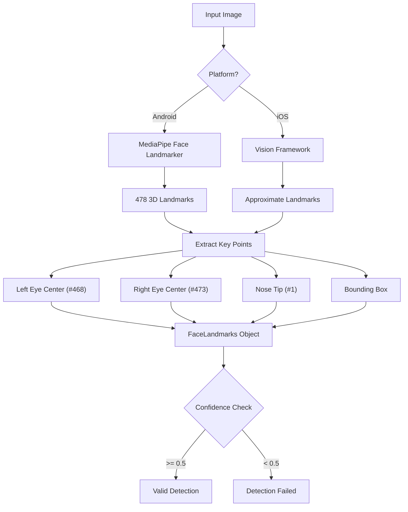
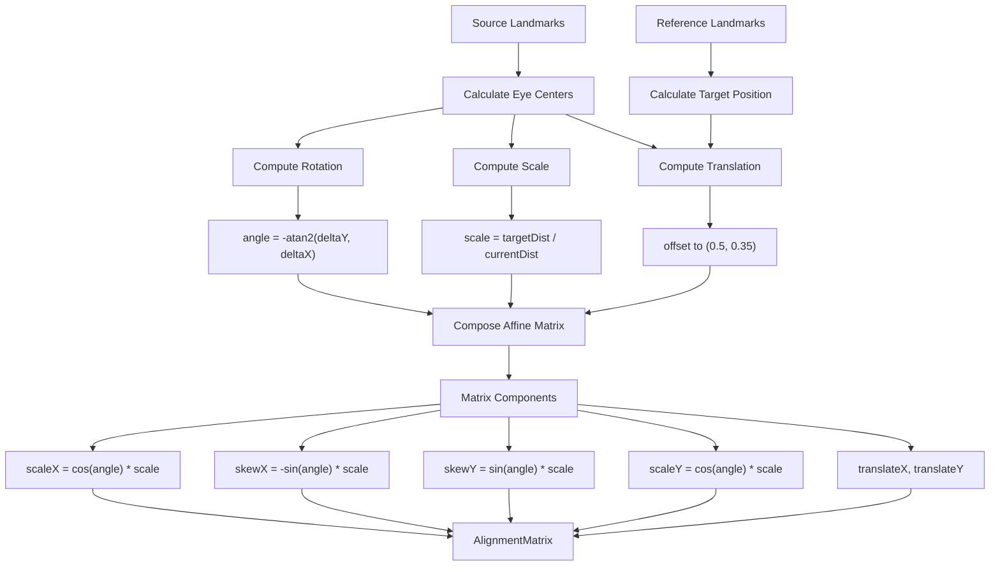
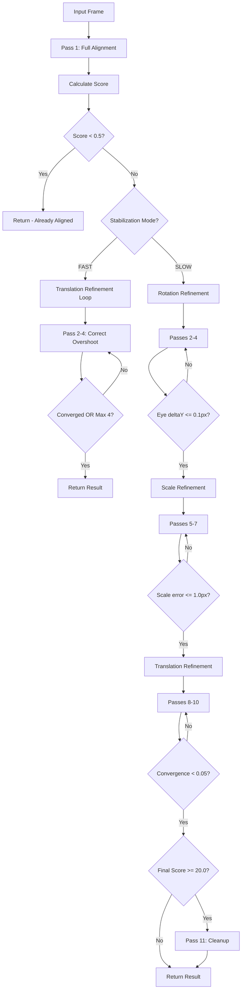
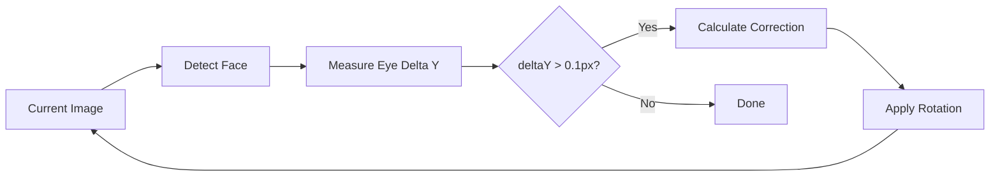
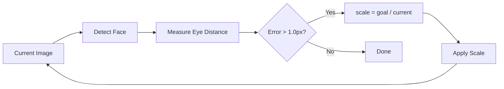
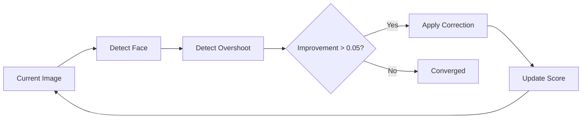
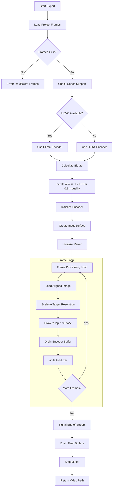
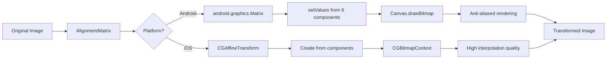
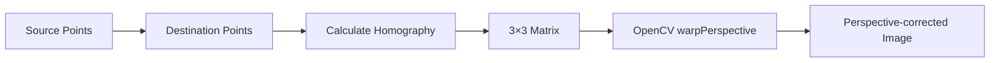

# FrameLapse Algorithms

This document describes the core algorithms used in FrameLapse for face detection, alignment, stabilization, and video compilation.

## Table of Contents

- [Face Detection Pipeline](#face-detection-pipeline)
- [Face Alignment Algorithm](#face-alignment-algorithm)
- [Multi-Pass Stabilization](#multi-pass-stabilization)
- [Video Compilation Pipeline](#video-compilation-pipeline)
- [Affine Transformation](#affine-transformation)
- [Mathematical Reference](#mathematical-reference)

---

## Face Detection Pipeline

FrameLapse uses platform-specific ML frameworks for face detection, unified through a common interface.

### Flow Diagram



### Platform Implementations

| Platform | Framework | Landmarks | GPU Acceleration |
|----------|-----------|-----------|------------------|
| Android | MediaPipe Face Landmarker | 478 3D points | Yes (with CPU fallback) |
| iOS | Vision Framework | Approximated from bounding box | Native optimization |

### Key Landmark Indices (MediaPipe)

| Index | Point | Usage |
|-------|-------|-------|
| 468 | Left iris center | Primary eye reference |
| 473 | Right iris center | Primary eye reference |
| 1 | Nose tip | Face center reference |
| 33 | Left eye outer corner | Fallback eye reference |
| 263 | Right eye outer corner | Fallback eye reference |

### Confidence Thresholds

| Mode | Detection | Presence | Tracking | Use Case |
|------|-----------|----------|----------|----------|
| Standard | 0.5 | 0.5 | 0.5 | Stored image analysis |
| Realtime | 0.3 | 0.3 | 0.3 | Live camera preview |

### Code Location

- Interface: `domain/src/commonMain/.../service/FaceDetector.kt`
- Android: `composeApp/src/androidMain/.../platform/FaceDetectorImpl.kt`
- iOS: `composeApp/src/iosMain/.../platform/FaceDetectorImpl.kt`

---

## Face Alignment Algorithm

The alignment algorithm transforms source images so that facial features match a reference position.

### Flow Diagram



### Transformation Steps

1. **Calculate Eye Centers**
   - Extract left and right eye center coordinates from landmarks
   - Compute midpoint between eyes as face center

2. **Compute Rotation**
   - Calculate angle needed to make eyes horizontal
   - Formula: `angle = -atan2(rightEye.y - leftEye.y, rightEye.x - leftEye.x)`

3. **Compute Scale**
   - Measure current distance between eyes
   - Scale to target eye distance (default: 50% of canvas width)
   - Formula: `scale = targetEyeDistance / currentEyeDistance`

4. **Compute Translation**
   - Position face center at target location
   - Default target: (0.5, 0.35) - centered horizontally, slightly above vertical center

5. **Compose Matrix**
   - Combine all transformations into a single affine matrix
   - Order: Scale → Rotate → Translate

### Code Location

- `domain/src/commonMain/.../usecase/face/CalculateAlignmentMatrixUseCase.kt`

---

## Multi-Pass Stabilization

The stabilization algorithm iteratively refines alignment for optimal results.

### Flow Diagram



### Mode Comparison

| Aspect | FAST Mode | SLOW Mode |
|--------|-----------|-----------|
| Max Passes | 4 | 11 |
| Refinement | Translation only | Rotation → Scale → Translation |
| Speed | ~100ms | ~500ms |
| Accuracy | Good | Excellent |
| Use Case | Live preview | Final export |

### Stabilization Score

The score measures alignment quality based on eye position deviation:

```
leftDist = sqrt((detected.left.x - goal.left.x)² + (detected.left.y - goal.left.y)²)
rightDist = sqrt((detected.right.x - goal.right.x)² + (detected.right.y - goal.right.y)²)
averageDist = (leftDist + rightDist) / 2
score = (averageDist * 1000) / canvasHeight
```

### Score Thresholds

| Score | Interpretation | Action |
|-------|----------------|--------|
| < 0.5 | Perfect alignment | No correction needed |
| < 20.0 | Successful stabilization | Accept result |
| >= 20.0 | Stabilization failed | Flag for manual adjustment |

### Refinement Algorithms

#### Rotation Refinement



- Measures vertical difference between eyes
- Applies rotation correction until eyes are horizontal (within 0.1px)

#### Scale Refinement



- Measures current eye distance vs goal
- Applies scale factor until within 1.0px tolerance

#### Translation Refinement



- Detects and corrects position overshoot
- Converges when improvement falls below 0.05

### Code Location

- `domain/src/commonMain/.../usecase/face/MultiPassStabilizationUseCase.kt`
- `domain/src/commonMain/.../usecase/face/RefineRotationUseCase.kt`
- `domain/src/commonMain/.../usecase/face/RefineScaleUseCase.kt`
- `domain/src/commonMain/.../usecase/face/RefineTranslationUseCase.kt`

---

## Video Compilation Pipeline

The video compilation process assembles aligned frames into a smooth timelapse video.

### Flow Diagram



### Codec Selection

| Codec | Container | Compatibility | Compression | Speed |
|-------|-----------|---------------|-------------|-------|
| H.264 | MP4 | Universal | Good | Medium |
| HEVC | MP4 | Modern devices | Better | Faster |

### Bitrate Calculation

```
baseBitrate = width × height × fps × 0.1
qualityMultiplier:
  - Low: 0.5
  - Medium: 1.0
  - High: 2.0
  - Ultra: 3.0

finalBitrate = clamp(baseBitrate × qualityMultiplier, 1_000_000, 50_000_000)
```

### Resolution Presets

| Preset | Resolution | Typical Bitrate (30fps, Medium) |
|--------|------------|--------------------------------|
| 480p | 854 × 480 | ~1.2 Mbps |
| 720p | 1280 × 720 | ~2.8 Mbps |
| 1080p | 1920 × 1080 | ~6.2 Mbps |
| 4K | 3840 × 2160 | ~24.9 Mbps |

### Platform Implementations

| Platform | Encoder | Container | Features |
|----------|---------|-----------|----------|
| Android | MediaCodec | MediaMuxer (MP4) | Hardware acceleration, surface input |
| iOS | AVAssetWriter | MP4/MOV | Core Video pixel buffers |

### Code Location

- Interface: `domain/src/commonMain/.../service/VideoEncoder.kt`
- Use Case: `domain/src/commonMain/.../usecase/export/CompileVideoUseCase.kt`
- Android: `composeApp/src/androidMain/.../platform/VideoEncoderImpl.kt`
- iOS: `composeApp/src/iosMain/.../platform/VideoEncoderImpl.kt`

---

## Affine Transformation

The affine transformation applies alignment matrices to images.

### Flow Diagram



### Matrix Structure

The 2D affine transformation matrix:

```
| a  b  tx |     | scaleX   skewX    translateX |
| c  d  ty |  =  | skewY    scaleY   translateY |
| 0  0  1  |     | 0        0        1          |
```

For rotation and uniform scaling:

```
| cos(θ)×s  -sin(θ)×s   tx |
| sin(θ)×s   cos(θ)×s   ty |
| 0          0          1  |

where:
  θ = rotation angle (radians)
  s = scale factor
  (tx, ty) = translation offset
```

### Homography Transformation

For perspective correction (landscape/scenery mode):



The 3×3 homography matrix handles:
- Perspective distortion
- Rotation in 3D space
- Non-uniform scaling

### Code Location

- Android Affine: `composeApp/src/androidMain/.../platform/AndroidBitmapTransformer.kt`
- Android Homography: `composeApp/src/androidMain/.../platform/AndroidOpenCvTransformer.kt`
- iOS: `composeApp/src/iosMain/.../platform/IosImageTransformer.kt`

---

## Mathematical Reference

### Eye Center Calculation

```kotlin
eyeCenter = Point(
    x = (leftEye.x + rightEye.x) / 2,
    y = (leftEye.y + rightEye.y) / 2
)
```

### Eye Distance

```kotlin
eyeDistance = sqrt(
    (rightEye.x - leftEye.x)² + (rightEye.y - leftEye.y)²
)
```

### Rotation Angle

```kotlin
// Angle to make eyes horizontal (negative to rotate clockwise)
angle = -atan2(
    rightEye.y - leftEye.y,
    rightEye.x - leftEye.x
)
```

### Scale Factor

```kotlin
scale = targetEyeDistance / currentEyeDistance
```

### Translation Offset

```kotlin
// After rotation and scaling
translatedCenter = applyRotationAndScale(eyeCenter, angle, scale)
offset = targetCenter - translatedCenter
```

### Stabilization Score

```kotlin
leftError = sqrt((detectedLeft.x - goalLeft.x)² + (detectedLeft.y - goalLeft.y)²)
rightError = sqrt((detectedRight.x - goalRight.x)² + (detectedRight.y - goalRight.y)²)
score = ((leftError + rightError) / 2) * 1000 / canvasHeight
```

### Convergence Detection

```kotlin
isConverged = abs(previousScore - currentScore) < 0.05
```

---

## Performance Considerations

### Memory Management

- Bitmap pooling on Android to reduce allocations
- Manual `recycle()` calls after transformation
- Streaming processing for large frame counts

### Concurrency

- Thread-safe MediaPipe with mutex locks
- Background dispatchers for image processing
- Main-safe ViewModel state updates

### GPU vs CPU

| Operation | Android | iOS |
|-----------|---------|-----|
| Face Detection | GPU preferred, CPU fallback | Native optimization |
| Image Transform | CPU (Canvas) | GPU (Core Image) |
| Video Encoding | Hardware acceleration | Hardware acceleration |

### Optimization Tips

1. Use FAST mode for preview, SLOW mode for export
2. Process frames in batches during compilation
3. Scale images before transformation for large resolutions
4. Check storage availability before export (2MB per frame estimate)
