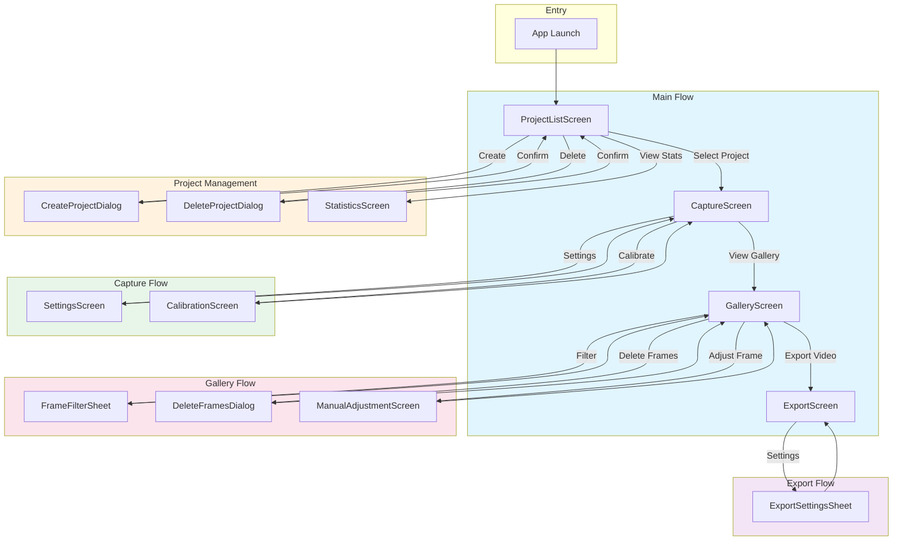

# Navigation Map

This document describes the screen flow and navigation structure of FrameLapse.

## Overview

FrameLapse uses **Navigation 3** for multiplatform navigation with:
- Type-safe routing via `NavKey` classes
- Back stack management with state preservation
- ViewModel lifecycle integration
- Polymorphic serialization for state restoration

---

## Navigation Flow Diagram



---

## Screen Reference

### Main Screens

| Screen | NavKey | Parameters | Purpose |
|--------|--------|------------|---------|
| Project List | `ProjectListKey` | None | Home screen, project management |
| Capture | `CaptureKey` | `projectId: String` | Camera capture with face detection |
| Gallery | `GalleryKey` | `projectId: String` | Frame browser and management |
| Export | `ExportKey` | `projectId: String` | Video export configuration |
| Settings | `SettingsKey` | None | App-wide settings |

### Utility Screens

| Screen | NavKey | Parameters | Purpose |
|--------|--------|------------|---------|
| Calibration | `CalibrationKey` | None | Set face alignment reference |
| Manual Adjustment | `ManualAdjustmentKey` | None | Fine-tune frame landmarks |
| Statistics | `StatisticsKey` | None | Project and global stats |

### Dialogs

| Dialog | NavKey | Parameters | Purpose |
|--------|--------|------------|---------|
| Create Project | `CreateProjectDialogKey` | None | New project creation |
| Delete Project | `DeleteProjectDialogKey` | None | Confirm project deletion |
| Delete Frames | `DeleteFramesDialogKey` | None | Confirm frame deletion |

### Bottom Sheets

| Sheet | NavKey | Parameters | Purpose |
|-------|--------|------------|---------|
| Frame Filter | `FrameFilterSheetKey` | None | Filter frames by date/quality |
| Export Settings | `ExportSettingsSheetKey` | None | Video export options |

---

## Screen Details

### ProjectListScreen

**Entry Point**: App launch

**Features**:
- List of all projects with thumbnails
- Create new project button
- Project actions (delete, view stats)
- Last capture date display

**Navigation Targets**:
- → `CaptureScreen` (select project)
- → `CreateProjectDialog` (create button)
- → `DeleteProjectDialog` (delete action)
- → `StatisticsScreen` (stats action)

---

### CaptureScreen

**Entry Point**: Select project from list

**Features**:
- Live camera preview with face detection
- Ghost image overlay from previous frame
- Grid overlay for manual alignment
- Capture button with confidence feedback
- Flash and camera toggle controls

**Navigation Targets**:
- → `GalleryScreen` (gallery button)
- → `SettingsScreen` (settings button)
- → `CalibrationScreen` (calibrate action)
- ← `ProjectListScreen` (back)

---

### GalleryScreen

**Entry Point**: Gallery button from Capture

**Features**:
- Grid view of all frames
- Selection mode for batch operations
- Date-based grouping
- Frame quality indicators
- Filter by date range or quality

**Navigation Targets**:
- → `ExportScreen` (export button)
- → `ManualAdjustmentScreen` (adjust frame)
- → `FrameFilterSheet` (filter button)
- → `DeleteFramesDialog` (delete selected)
- ← `CaptureScreen` (back)

---

### ExportScreen

**Entry Point**: Export button from Gallery

**Features**:
- Preview of aligned frames
- Resolution selection
- FPS slider
- Quality preset selection
- Codec selection (H.264/HEVC)
- Export progress with cancellation

**Navigation Targets**:
- → `ExportSettingsSheet` (settings button)
- ← `GalleryScreen` (back)

---

### SettingsScreen

**Entry Point**: Settings button from Capture

**Features**:
- Notification preferences
- Default capture settings
- Storage management
- About information

**Navigation Targets**:
- ← `CaptureScreen` (back)

---

### CalibrationScreen

**Entry Point**: Calibrate action from Capture

**Features**:
- Set reference face position
- Grid overlay for precise positioning
- Preview alignment result
- Save/reset calibration

**Navigation Targets**:
- ← `CaptureScreen` (back/save)

---

### ManualAdjustmentScreen

**Entry Point**: Adjust frame from Gallery

**Features**:
- Drag landmarks to correct positions
- Preview transformation result
- Reset to auto-detected values
- Save adjustments

**Navigation Targets**:
- ← `GalleryScreen` (back/save)

---

### StatisticsScreen

**Entry Point**: Stats action from Project List

**Features**:
- Total frame count
- Capture streak tracking
- Average capture confidence
- Project timeline visualization

**Navigation Targets**:
- ← `ProjectListScreen` (back)

---

## Navigation Code Structure

### NavKey Definitions

```kotlin
// composeApp/src/commonMain/.../navigation/NavKeys.kt

@Serializable
data object ProjectListKey : NavKey

@Serializable
data class CaptureKey(val projectId: String) : NavKey

@Serializable
data class GalleryKey(val projectId: String) : NavKey

@Serializable
data class ExportKey(val projectId: String) : NavKey

@Serializable
data object SettingsKey : NavKey

// Dialogs
@Serializable
data object CreateProjectDialogKey : NavKey

@Serializable
data object DeleteProjectDialogKey : NavKey

@Serializable
data object DeleteFramesDialogKey : NavKey

// Sheets
@Serializable
data object FrameFilterSheetKey : NavKey

@Serializable
data object ExportSettingsSheetKey : NavKey
```

### Navigation Host Setup

```kotlin
// composeApp/src/commonMain/.../navigation/AppNavHost.kt

@Composable
fun AppNavHost() {
    val backStack = rememberNavBackStack(ProjectListKey)

    NavDisplay(backStack) { entry ->
        when (val key = entry.key) {
            is ProjectListKey -> ProjectListScreen(
                onNavigateToCapture = { projectId ->
                    backStack.add(CaptureKey(projectId))
                }
            )
            is CaptureKey -> CaptureScreen(
                projectId = key.projectId,
                onNavigateToGallery = {
                    backStack.add(GalleryKey(key.projectId))
                }
            )
            // ... other screens
        }
    }
}
```

### State Preservation

Navigation 3 automatically preserves:
- ViewModel instances per screen
- Saveable state (e.g., scroll positions)
- Back stack history

```kotlin
NavEntry(key) {
    SaveableStateHolder {
        ViewModelStoreProvider {
            ScreenContent()
        }
    }
}
```

---

## Navigation Patterns

### Forward Navigation

```kotlin
// Push new screen onto back stack
backStack.add(CaptureKey(projectId))
```

### Back Navigation

```kotlin
// Pop current screen
backStack.removeLastOrNull()

// Or use system back button handling
BackHandler {
    backStack.removeLastOrNull()
}
```

### Replace Navigation

```kotlin
// Replace current screen
backStack.replaceLast(newKey)
```

### Dialog Navigation

```kotlin
// Show dialog (added to separate layer)
dialogBackStack.add(CreateProjectDialogKey)

// Dismiss dialog
dialogBackStack.removeLastOrNull()
```

### Sheet Navigation

```kotlin
// Show bottom sheet
sheetBackStack.add(FrameFilterSheetKey)

// Dismiss sheet
sheetBackStack.removeLastOrNull()
```

---

## Deep Link Support

Future support for deep links:

| URI Pattern | Target Screen |
|-------------|---------------|
| `framelapse://projects` | ProjectListScreen |
| `framelapse://capture/{projectId}` | CaptureScreen |
| `framelapse://gallery/{projectId}` | GalleryScreen |
| `framelapse://export/{projectId}` | ExportScreen |

---

## Related Documentation

- [Architecture](../Architecture.md) - Overall application architecture
- [API Reference](./API_REFERENCE.md) - ViewModels and use cases
- [Quick Start](./QUICK_START.md) - Getting started guide
